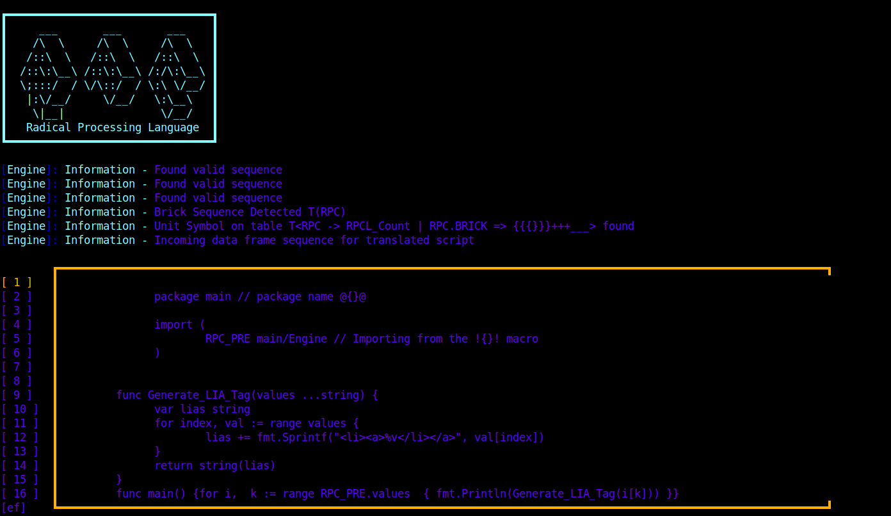

```
                                   
    _/_/_/    _/_/_/      _/_/_/   
   _/    _/  _/    _/  _/          
  _/_/_/    _/_/_/    _/           
 _/    _/  _/        _/            
_/    _/  _/          _/_/_/       
                                   
Radical Processing Language                                    
```

# Description 

RPC or Radical Processing Language is a concept design for a upcoming programming language that will be built currently using the Go programming language. RPC is not a "real" programming language it has rather just been developed, RPC is designed for many interesting tasks. Its general purpose is to show programmers a concept of " easy applications are never hard, while advanced applications will always be harder " in RPC that is the opposite. 

For example if you want to impliment the pythagorean theorem in RPC you would do 

```
@#{<Main.rpc>}#@

: Integer : Integer : Integer => PYTHAG(a, val, b) ({
      RPCRET ~> RPC_SQRT(a ** val + b ** val)
})

: VOID => MAIN() {
  PYTHAG(15, 2, 24)
}

```

simple implimentation, but if you wanted to print out hello world you would have to make it like so 

```
@#{Main.rpc}#@
@#{<stdandardlibrary>}#@

: INTEGER => MAIN(code) {
  RPCPO << [code] >> [
      RPC.STD.OUT << ---- >> 
            code 
      RPC.STD.END.OUT
  ]
}

```

The point being that RPC is no lazy mans language for people who are new to the programming world, rather developers who understand math and confusion easily.

# How does RPC run 

RPC currently has no engine or compiler out right now but RPC is built and implimented into custom servers and applications with a engine written using the GO programming language to run data. RPC has its own formatting language which requires its own engine and own backer right now, this formatting language is used for HTML and CSS code files.

Simply name a file 

`Html_FileName.tmpl.rpc`

then enter your code like so 

```
init RPC templating
    
    {
        (
            [
                RPC -> RPCL6_Count | RPC.BRICK => {{{
                    RPC:::Unit::SYMBOL | RPC.BRICK START

                      !!!-> rpcn 
                                This is where the HTML code will be renedered by the engine
                      !!!<-  

                    RPC::Unit::SYMBOL | RPC.BRICK END
                }}}
            ]
        )
    }

end RPC templating
```

RPC has its own templating symbol written with and embedded into the engine, you call RPC.BRICK START after the RPC:::Unit::SYMBOL block telling the engine to generate data under whatever that brick is. So say you have the following HTML file 

```html
<!DOCTYPE html>
<html lang="en">
<head>
    <meta charset="UTF-8">
    <meta http-equiv="X-UA-Compatible" content="IE=edge">
    <meta name="viewport" content="width=device-width, initial-scale=1.0">
    <title>Document</title>
</head>
<body>
    
</body>
</html>
```

and you have a go file that has a structure filled of users 

```go
type UserInfo struct {
  Usernames []string
}
```

and you wanted to range over that and print out a div for every bit of data, this is how you would do it in RPC.

```html


<!DOCTYPE html>
<html lang="en">
<head>
    <meta charset="UTF-8">
    <meta http-equiv="X-UA-Compatible" content="IE=edge">
    <meta name="viewport" content="width=device-width, initial-scale=1.0">
    <title>Document</title>
</head>
<body>
    init RPC templating
    
    {
        (
            [
                RPC -> RPCL6_Count | RPC.BRICK => {{{
                    RPC:::Unit::SYMBOL | RPC.BRICK START

                       var data User>>
                       for data := range User.Username {
                            RPC.generatediv("<div class="username"> %s </div>", data);
                        }

                    RPC::Unit::SYMBOL | RPC.BRICK END
                }}}
            ]
        )
    }

end RPC templating
</body>
</html>
```

the engine will generate all the data needed, since you can run go locally in RPC if the variables are defined you can use them to generate HTML. 

# How would the engine work in this case 

Well the engine has to be developed really well and thought of really well, RPC has identifiers which allow it to be well a decent formatting language for HTML. The engine will scower the HTML file until it sees that there is a title for `init RPC templating` when it sees this symbol it will expect 5 things 

`{`, `(`, `[`, then a call to `RPC -> RPCL6_Count | RPC.Brick => {{{` once it verifies the line count then it will continue on to see a Unit symbol, the unit symbol decleration tells the engine the next block is a unit, this unit will be the go script, all the code underneath this brick will be taken as go script, then until it finds RPC::Unit::SYMBOL | RPC.BRICK END it will put it into a go script and run it then generate the HTML accordingly. THe engine works in wacky ways and is not just inacurate like this. 

The reason you have to declare 

`RPC -> RPCL` is because the engine relies on the line count of the HTML-RPC brick to create and predict the next rendering interface for the HTML code

so if you start to call to render on line 90 of your HTML file you must have `RPC -> RPCL90_COUNT` if not the engine will error out saying it has a unexpected symbol on so and so line but needs so and so line count. if the line number is wrong the engine will correct the code itself and assume that you meant that line then continue going.

# photo of the engine translating raw RPCT code 



# Other examples 

Here is an example of RPC's super set files which are sets of files that can not only let you program and use Lua, C and C++ but mix classes and modules together as well. these files are known as RPCLCCPQ files 

```
@#{<lualib>}#@
@#{<libc>}#@
@#{<supersetc>}#@
@#{<stdlib>}#
@#{CLASS(filename.rpc++)}#@
@#{$$MOD(rpch++)$$}#@

RPC Class Structure {
    RPC>*MODULE (modulename) START* 
            ||
                RPCO INIT {{{

                        (  ----> RPCOUTPUT << PREPARE("hello world")    )

                            ~> RPCOUTPUT
                }}}
            ||  
    RPC>*MODULE (modulename) END^
}

String : String : interface{} => CALL_LUA(X, Y, Z) -> LUA {
    a=math.abs(Y-Y) 
    b=math.abs(X-X)
    c=math.sqrt(a*a+b*b)
    print(c)
}

VOID : => CALL_CPP() -> C++ {
    const auto data = nullptr;
    namespace functions {
        void functiontocall();
    };
}

String : => CALL_C(message) -> C {
    printf("%s", message);
}
```
 
